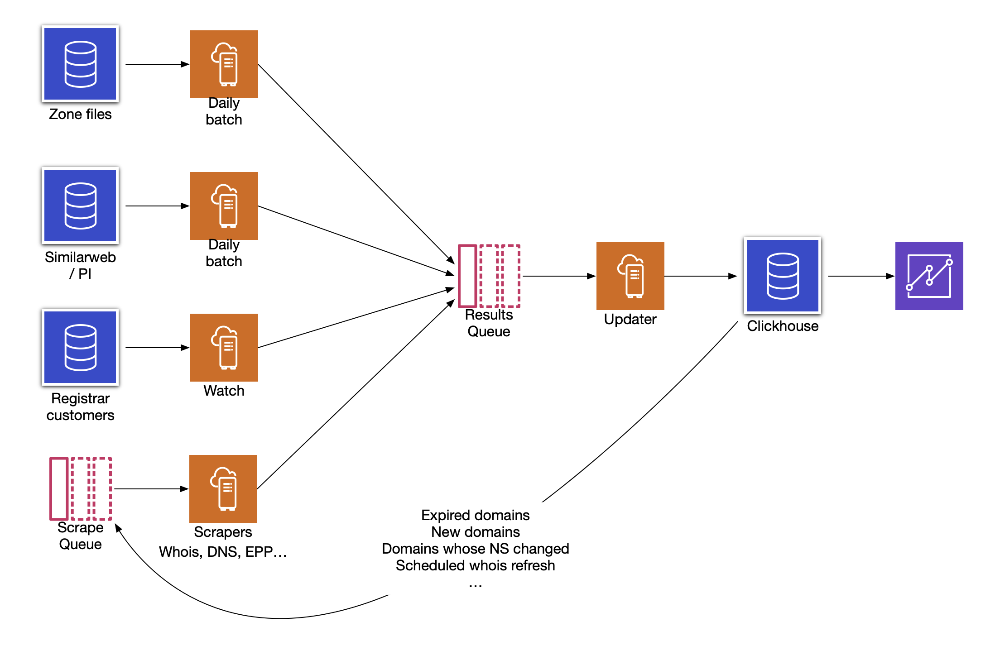

# Cadia

Mines data for all domains. Sources will include zone files, whois, DNS, EPP and others.

Data is stored in clickhouse and communication is via kafka.

Cadia is at the prototype stage as of 2022-08-25

## Components

  * update.py - receives results on the `results` queue and writes them to clickhouse
  * zonefile.py - parses TLD zone files. Can determine changes from previous file and update the changed domains
  * consumer.py - consumes the `results` queue and displays the rows. For debugging
  * agent.py - agent that runs scrapers and returns results

## Tests

Run `pytest-3` in the root directory. Tests are in the `tests` directory.

There's a utility script to test scraper code in `scrapetest.py`. Eg `python3 scrapetest.py --scraper=rdap --domain=google.com`. It runs the scraper locally and does not use kafka or clickhouse.

## Development

  * Target is python 3 on Debian bookworm or later
  * Required libraries (already managed on dev and prod servers): `apt install python3-pytest python3-kafka python3-clickhouse-driver python3-dnspython python3-attr`

## Scrapers

Scrapers are libraries to scrape a particular data source such as DNS. They implement the logic to scrape it and return the results. They are not concerned with queueing, scheduling or rate limiting, those are handled by the agent.

Each scraper subclasses BaseScraper (`scrapers/base.py`). They must implement `scrape_domain(self,domain)`. It must return a subclass of `Result`, or throw an exception.

Return a `scraper.base.ThrottledException` when it's being throttled to request the agent to back off.

A scraper may also implement `shard_for_domain(self,domain)` which returns a string which is used to divide up work and isolate rate limiting and throttling. For example in RDAP it returns the RDAP server hostname, so we can rate limit per RDAP server.

## Web app

The web app is built with flask. The main script is `app.py`. Templates are in `templates`.

### Adding columns

  * Add to the appropriate class in result.py or add a new one
    * If you added a new Result subclass, also add it in Result.fromdict
  * Add the columns in three tables in this order: history, search_results, domains. See `lib/sql/cadia-clickhouse/6_add_pm.sql` for an example
  * Update the materialised view for the history:
    * Stop update.py
    * on each clickhouse server: `drop view history_mv` then `create materialized view history_mv to history as select toDate(last_modified) as date, * from domains`
    * resume update.py
  * For the UI:
    * Add to the Search class in search.py to allow filtering on those columns
    * Add to templates/part/results.html
    * Add columns in templates/results.html if needed
